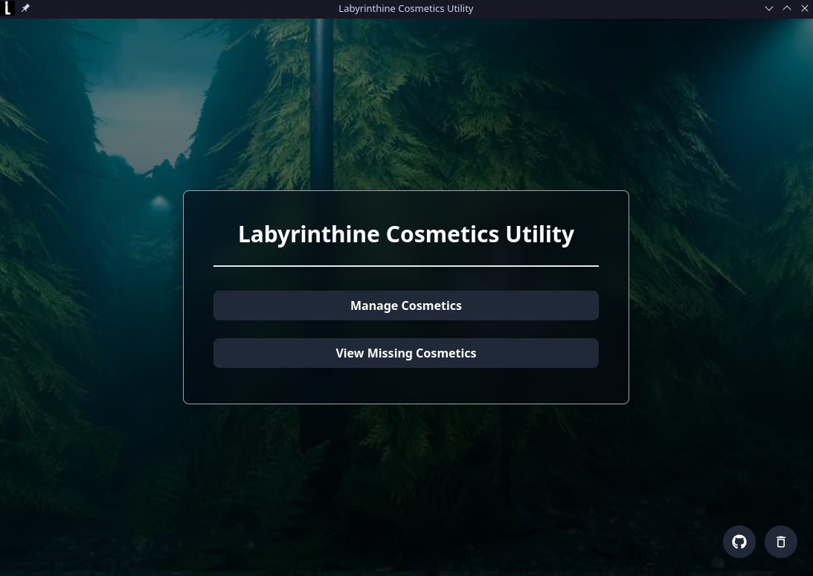

# Labyrinthine Cosmetics Utility Electron App



A desktop utility built with Electron to manage cosmetics in the game _Labyrinthine_.

## Features

- Browse available cosmetics
- Unlock cosmetics
- See missing cosmetics
- User-friendly interface
- Cross-platform support

## Getting Started

### Installation

1. Clone the repository:
   ```bash
   git clone https://github.com/TiagoRibeiro25/electron-labyrinthine-cosmetics-utility.git
   cd electron-labyrinthine-cosmetics-utility
   ```
2. Install dependencies:
   ```bash
   npm install
   cd frontend
   npm install
   ```
3. Run the application:
   ```bash
   cd frontend
   npm run dev
   ```
on a separate terminal, run:
   ```bash
   npm run dev
   ```
